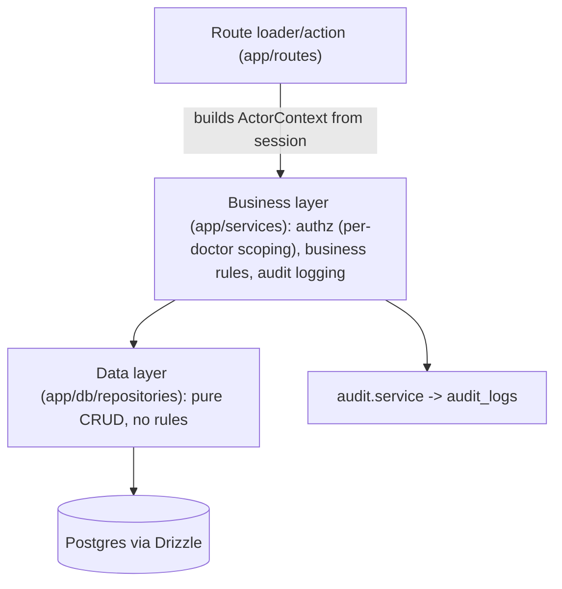
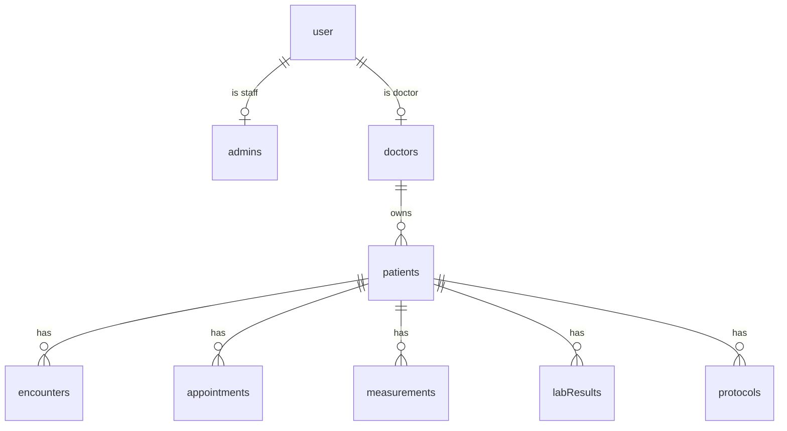

# Health EMR — Architecture & Data Model

> Functional-medicine Electronic Medical Record (EMR), built in Colombia. Goal: a HIPAA-grade, scalable system, delivered as an MVP first. This document is the reference spec for the data model, layering, roles, and compliance approach.

---

## 1. Context & goals

- **Product:** EMR focused on functional medicine.
- **Origin/operation:** Colombia.
- **Compliance target:** HIPAA-grade technical safeguards. Because the app operates in Colombia, the legally binding regime is **Ley 1581/2012 (Habeas Data)** plus **Resolución 866/2021** and **Resolución 1995/1999** (Historia Clínica Electrónica). The technical controls overlap ~90% with HIPAA, so we design for HIPAA-grade controls that also satisfy the Colombian requirements. Divergences are noted where relevant.
- **Delivery:** MVP first, then phased expansion. Non-essential features are deferred, but the schema is designed up front to accommodate the full scope.

### Key decisions (locked)

| Decision | Choice |
| --- | --- |
| Patient ownership | **Per-doctor** — each patient belongs to exactly one doctor; doctors only see their own patients. |
| Clinical scope (long-term) | **Full functional medicine** — demographics + encounters/notes + appointments + labs/biomarkers + protocols/supplements + timeline. Built in phases. |
| Audit strategy | **App-level, in the business/service layer** — every service method logs actor, action, entity, and before/after. Captures reads and writes. |

### Tech stack

- React Router (framework mode) for routing, loaders, and actions.
- Drizzle ORM + PostgreSQL.
- better-auth for authentication (email/password for MVP).

---

## 2. Layering: data layer vs. business layer

Responsibilities are split into three layers so that **authorization and audit live in exactly one place**.

- **Data layer** (`app/db/models` + new `app/db/repositories`): table definitions and pure CRUD functions. No auth, no logging, no business rules.
- **Business layer** (new `app/services`): the **only** place that enforces per-doctor scoping, applies business rules, and writes audit entries. Every method receives an `ActorContext` (who is acting, their role, IP, user agent, request ID).
- **Route layer** (`app/routes`): loaders/actions authenticate via better-auth, build the `ActorContext`, and call services. They never touch repositories directly.

> **Key rule:** PHI (Protected Health Information) is only reachable through services, so every read and write is auditable and correctly scoped.

---

## 3. Roles & tenancy (per-doctor ownership)

Three user types, mapped onto profile tables that reference the shared `user` identity:

- **Staff** → `admins` table. Super admins (the app owners); can access everything.
- **Doctor / Client** → new `doctors` profile table (license number, specialty), linked to a `user`. Owns patients. These are the paying customers.
- **Patient** → new `patients` table; each row references `doctors.id` (belongs to one doctor). **No patient login in the MVP** (no `user` row required for patients).

Additional notes:

- `organizations` / `members` tables are retained for a future multi-doctor clinic tier. A doctor may optionally belong to an organization, but authorization scopes by `doctorId` for now.
- A denormalized `role` enum is added to `user` (via better-auth additional fields) for fast route-guard checks. The profile tables remain the source of truth.

---

## 4. Fixes to the existing schema

- **Bug — ID type mismatch:** in `app/db/models/auth.ts`, `session.userId` and `account.userId` are declared as `text`, but `user.id` is a `uuid`. Postgres will reject or implicitly break these foreign keys. Change both FK columns to `uuid`.
- Add a `role` enum (`staff` | `doctor`) column to `user`.
- Add a `deletedAt` (soft-delete) column to all PHI tables. PHI is **never hard-deleted** (Colombian HCE retention + HIPAA).
- Add `relations()` entries for the new tables in `app/db/relations.ts`.

---

## 5. Data model

### 5.1 `doctors` (`app/db/models/doctors.ts`)

- `userId` → `user.id`
- `licenseNumber`
- `specialty`
- `active`
- timestamps + `deletedAt`

### 5.2 `patients` (`app/db/models/patients.ts`)

- **Ownership:** `doctorId` → `doctors.id`
- **Identity:**
  - `identificationType` — enum: `CC`, `TI`, `CE`, `PA`, `RC`, `PEP`, `NIT`
  - `identificationNumber`
  - Unique constraint on `(doctorId, identificationType, identificationNumber)`
- **Name:** `firstName`, `secondName` (nullable), `firstLastName`, `secondLastName` (nullable)
- `birthDate` (date) — **Recommended addition.** Not in the original field list, but essential for an EMR (age-based dosing, reference ranges, clinical decisions).
- `birthPlace` (text), `residencePlace` (text)
- **Contact:** `phone`, `email`
- `sex` (enum, nullable — recommended but not mandatory), `ethnicity` (text/enum, nullable)
- `heightCm`, `weightKg` (numeric, nullable) — **current snapshot only.** Full history lives in `measurements`, because these values change over time in functional medicine.
- timestamps + `deletedAt`

> **Sex vs. gender note:** `sex` here is biological sex for clinical purposes. If gender identity is needed later, add a separate optional `gender` field rather than overloading `sex`.

### 5.3 Functional-medicine clinical tables (Phases 2–3)

- **`encounters`** — consult notes: `patientId`, `doctorId`, `date`, `type`, subjective/objective/assessment/plan (text or JSONB), structured functional-medicine intake.
- **`appointments`** — `patientId`, `doctorId`, `startsAt`, `endsAt`, `status`.
- **`measurements`** — the vitals timeline: `patientId`, `takenAt`, `type` (height/weight/BP/etc.), `value`, `unit`.
- **`labResults` / `biomarkers`** — `patientId`, `panel`, `analyte`, `value`, `unit`, `referenceRange`, `takenAt`.
- **`protocols`** — functional-medicine treatment plans: `patientId`, supplements/interventions, dosage, start/end.

### 5.4 `audit_logs` (`app/db/models/audit.ts`)

- `id`, `createdAt`
- `actorUserId`, `actorRole`
- `action` — enum: `view`, `list`, `create`, `update`, `delete`, `export`, `login`, `login_failed`
- `entityType`, `entityId`
- `patientId` (nullable) — for fast per-patient access reports
- `ipAddress`, `userAgent`, `requestId`
- `metadata` (JSONB) — before/after diff or query params
- **Append-only:** no update or delete methods are exposed.

---

## 6. Business layer (`app/services`)

- **`context.ts`** — the `ActorContext` type + `buildContext(request, session)`.
- **`audit.service.ts`** — `record(ctx, { action, entityType, entityId, patientId, metadata })`.
- **Domain services** (`patients.service.ts`, `doctors.service.ts`, …) — each method:
  1. **Authorize** — staff = all; doctor = only their own `doctorId`.
  2. **Call** the repository.
  3. **Audit** — write an audit entry. Reads are logged too (`view` / `list`).
- **Repositories** (`app/db/repositories`) — raw Drizzle queries only.

---

## 7. Compliance controls (HIPAA + Colombian Ley 1581 / Res. 866)

| Area | Control |
| --- | --- |
| Access control / minimum necessary | Per-doctor scoping enforced in services; role guards in routes. |
| Audit | `audit_logs` capturing reads + writes with actor / IP / timestamp (HIPAA §164.312(b)). |
| In transit | Enforce TLS/HTTPS; secure, httpOnly session cookies (better-auth). |
| At rest | Managed Postgres encryption; optionally `pgcrypto` column encryption for the most sensitive free-text later. |
| Sessions | Short expiry + rotation via better-auth; log `login` / `login_failed`. |
| Retention & soft delete | `deletedAt` everywhere; never hard-delete PHI (Colombian HCE minimum retention). |
| Data-subject rights (Habeas Data) | Patient data export / rectification via services (Phase 4). |

> **Out of code scope:** Full HIPAA also requires organizational/process controls (Business Associate Agreements, compliant hosting, backup/DR). These are outside the MVP codebase but are tracked separately.

---

## 8. Build order (phases)

- **Phase 0 — Foundation:** fix ID types; add `role` enum + soft deletes; scaffold `repositories` / `services`; build `ActorContext` + `audit.service` + `audit_logs`. Generate migration.
- **Phase 1 — MVP core:** `doctors` + `patients` tables; services with audit; route guards; patient CRUD UI.
- **Phase 2:** `encounters` + `appointments`.
- **Phase 3:** `measurements`, `labResults`, `protocols` (functional-medicine specifics).
- **Phase 4 — Compliance hardening:** export/rectification, retention jobs, encryption review.

Each phase ends with `drizzle-kit generate` + migration and a typecheck.

---

## 9. Task checklist

- [ ] Fix `session.userId` / `account.userId` to `uuid` in `app/db/models/auth.ts` to match `user.id`.
- [ ] Add `role` enum (`staff` | `doctor`) to `user` via better-auth additional fields + schema.
- [ ] Add `deletedAt` soft-delete columns to all PHI tables.
- [ ] Create `app/db/models/audit.ts` (`audit_logs`, append-only) with `action` enum.
- [ ] Create `app/db/models/doctors.ts` (profile: license, specialty).
- [ ] Create `app/db/models/patients.ts` with full demographic fields + `birthDate` + identification enum + unique constraint.
- [ ] Add relations for doctors, patients, clinical tables, audit in `app/db/relations.ts`.
- [ ] Create `app/db/repositories` with pure CRUD functions per table.
- [ ] Create `app/services/context.ts` with `ActorContext` + `buildContext(request, session)`.
- [ ] Create `app/services/audit.service.ts` (record reads + writes).
- [ ] Create patients/doctors services enforcing per-doctor scoping + audit on every method.
- [ ] Add role-based route guards and wire loaders/actions to call services (not repositories).
- [ ] Phase 2–3: add encounters, appointments, measurements, labResults, protocols models + services.
- [ ] Run `drizzle-kit generate` + typecheck after each phase.
- [ ] Phase 4: data export/rectification, retention jobs, encryption review.

---

### Importing into Notion

Notion imports Markdown files directly (**Settings → Import → Markdown**, or drag the file into a page). The two `mermaid` code blocks will import as plain code blocks — to render them as diagrams, change the block's language to **Mermaid** in Notion. Tables and checklists convert automatically.
